# نرم افزار مدیریت درمانگاه

<ul>
<li> توضیح: نرم افزار جامع مدیریت نوبت‌دهی، آمار کلینیک، ثبت پرونده بیماران</li>
</ul>

## دمو

<!-- -------------- دموی نرم افزار -------------- -->

  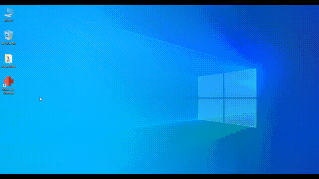

## امکانات نرم افزار

<ul>
<li>آمار کلینیک</li>
<li>ثبت پرونده بیماران</li>
<li>ثبت پزشکان</li>
<li>ثبت نوبت</li>
<li>ثبت ساعات کاری</li>
<li>ثبت کاربران</li>
<li>ثبت تخصص‌ها</li>
</ul>

## تکنولوژی‌های مورد استفاده
<ul>
<li> پیاده سازی شده با C# Windows Forms (.NET Framework v.4.8) </li>

<li> اتصال به پایگاه داده با استفاده از ADO.NET و Entity Framework v.6.5.2</li>

<li> مبتنی بر بانک اطلاعاتی Microsort SQL Server</li>

<li> استفاده از تقویم فارسی 
	<a href="https://www.nuget.org/packages/BPersianCalendar">BPersianCalendar v.5.0.0.0</a></li>
</ul>

## تصاویر

<!-- -------------- ورود کاربران -------------- -->

	ورود  
	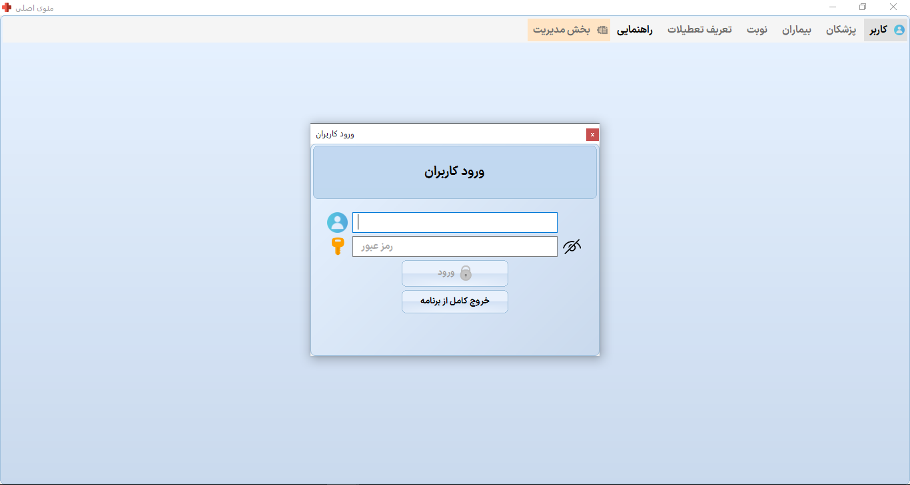

	بخشی از کد ورود  
	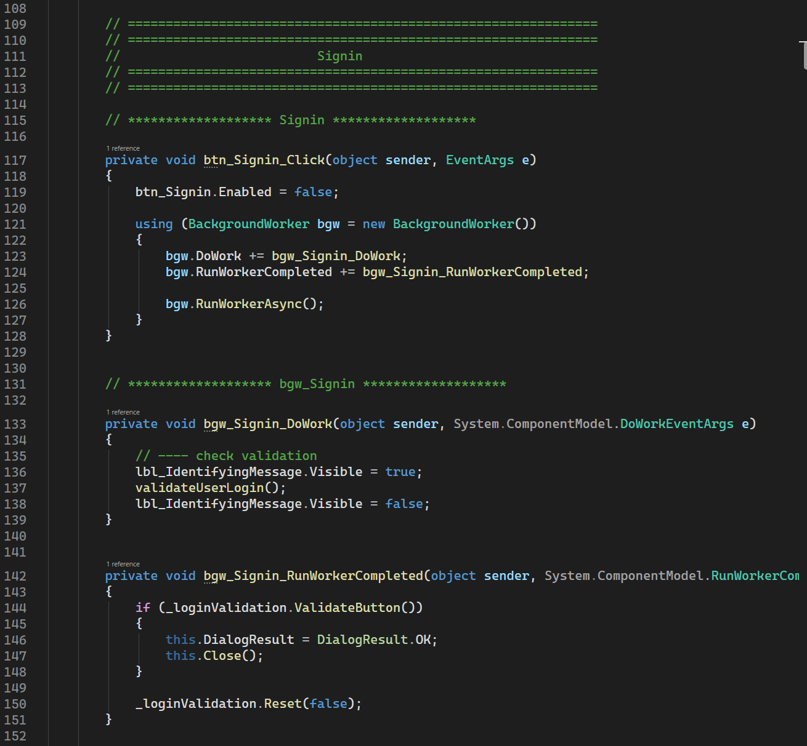

<!-- -------------- صفحه کاربران -------------- -->

	صفحه اولیه مدیر  
	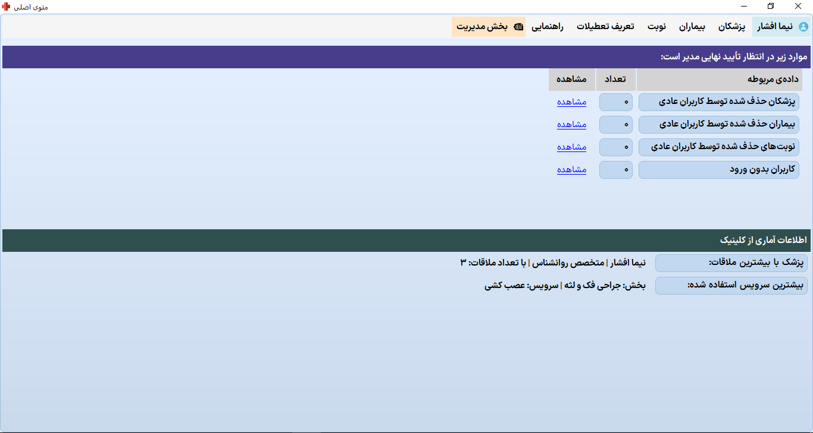

	صفحه اولیه دیگر کاربران  
	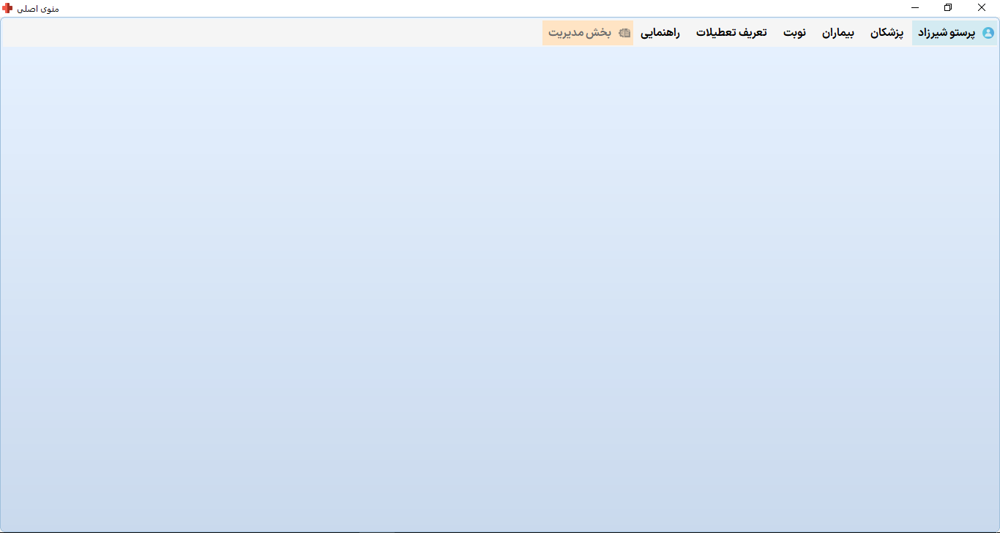

<!-- پزشکان -->

	منوی فهرست پزشکان  
	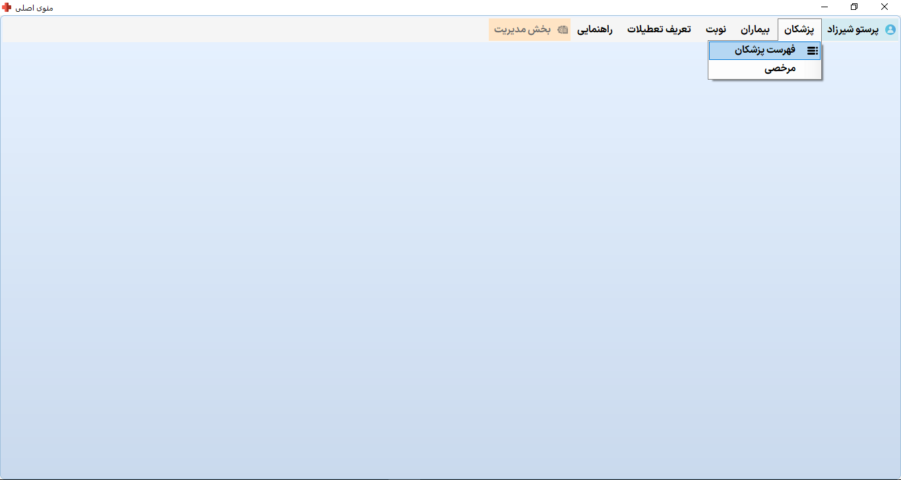

	فهرست پزشکان  
	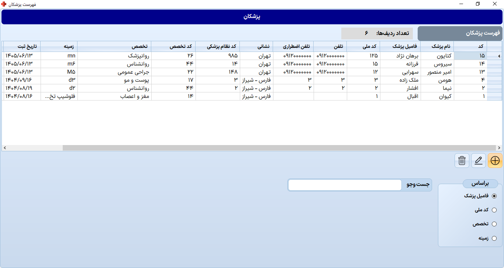

	افزودن پزشک  
	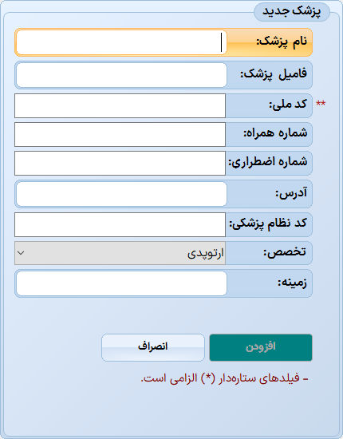

	بخشی از کد افزودن پزشک  
	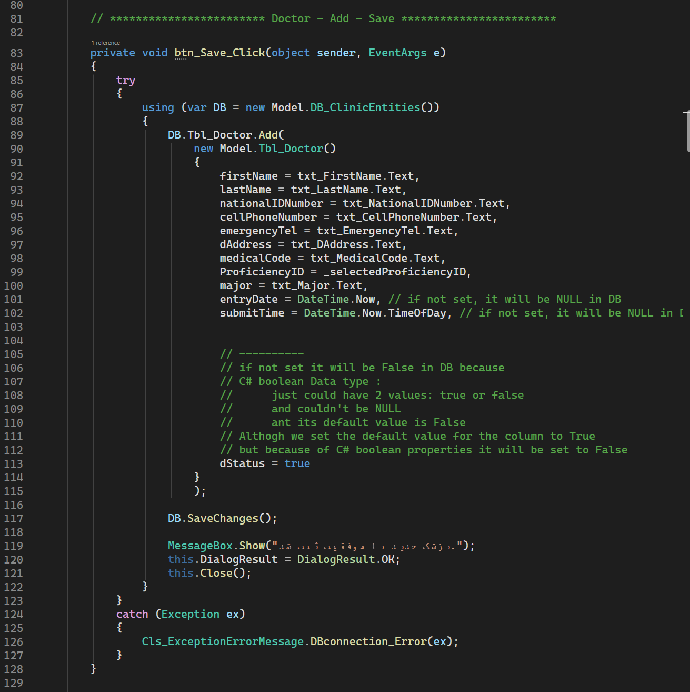

<!-- -------------- بیماران -------------- -->

	منوی فهرست بیماران  
	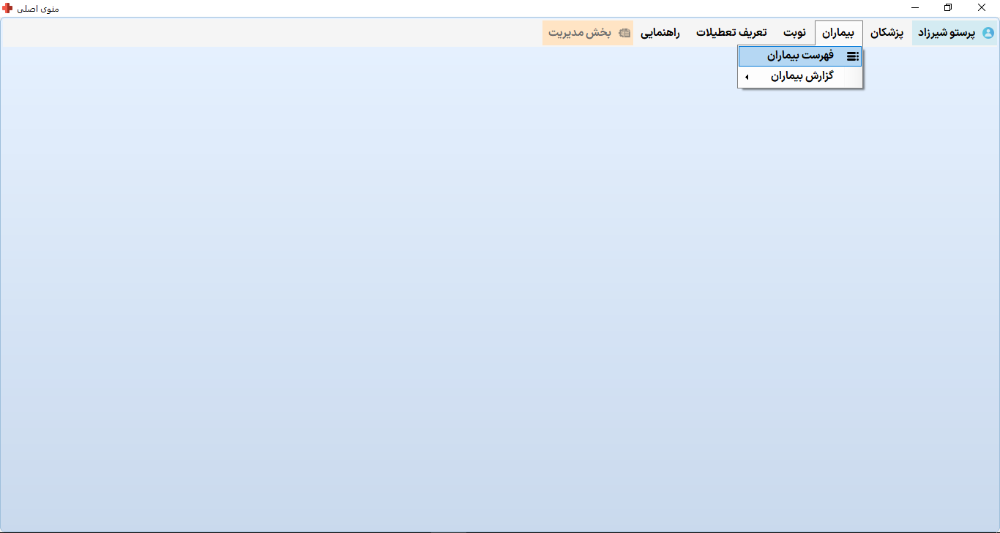

	فهرست بیماران  
	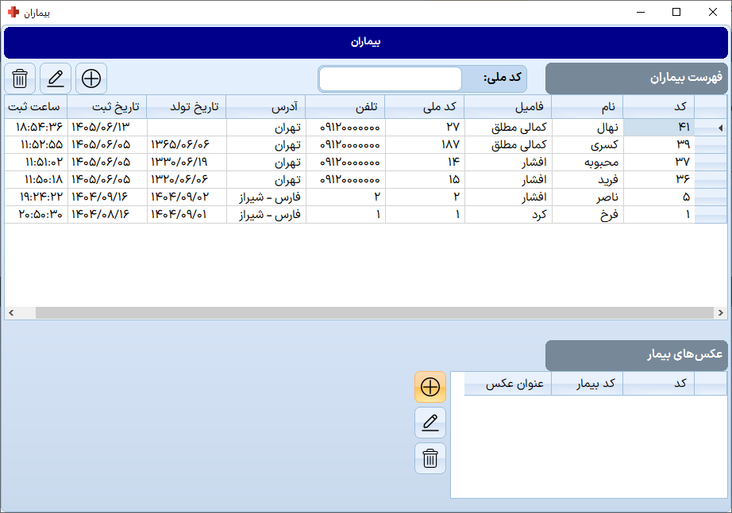

	افزودن بیمار  
	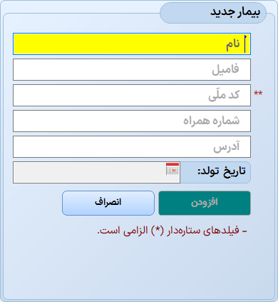

	بخشی از کد افزودن بیمار  
	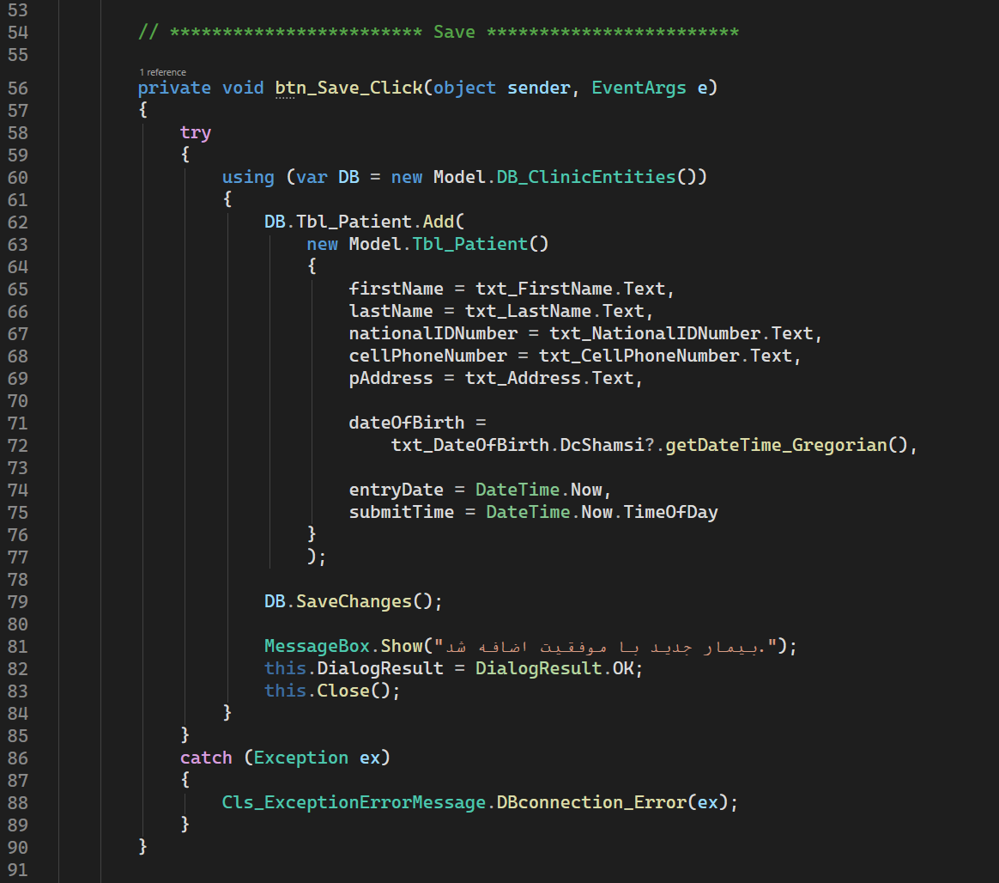

<!-- -------------- ثبت نوبت -------------- -->

	منوی ثبت نوبت  
	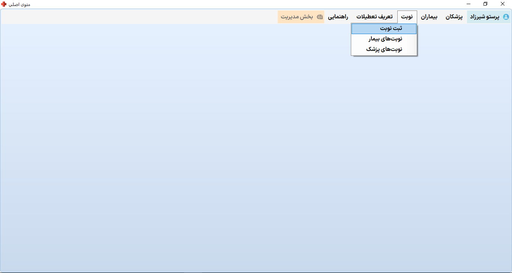

	ثبت نوبت  
	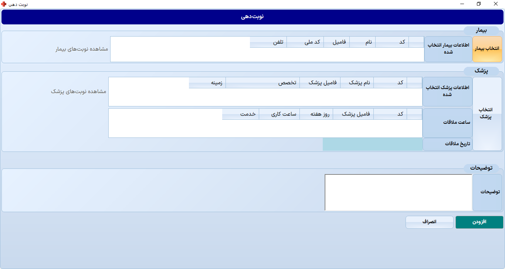

	انتخاب پزشک  
	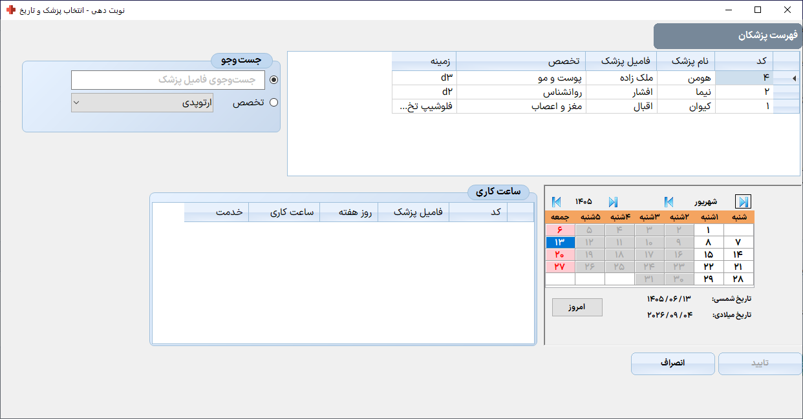

